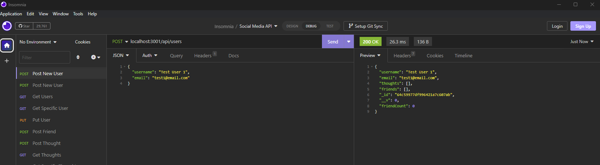
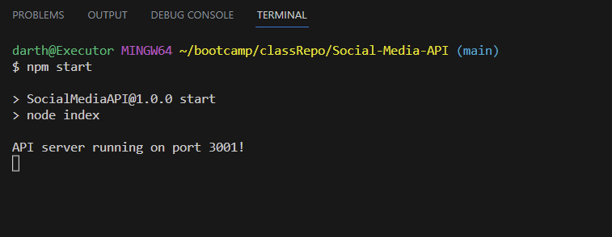

# Social-Media-API

## Description

This is a backend for a social media platform. It has a MongoDB based database for users, friends, thoughts, and reactions. There are api routes to perform RESTful CRUD operations with the ability to create, update, and delete entries in the database.

## Screenshot

## Link

GitHub Repo:
https://github.com/auswaller/Social-Media-API

Video Walkthrough:
https://drive.google.com/file/d/1p1A7OHQBT5tuglVzO6FVDG-CQSaWGCKm/view
